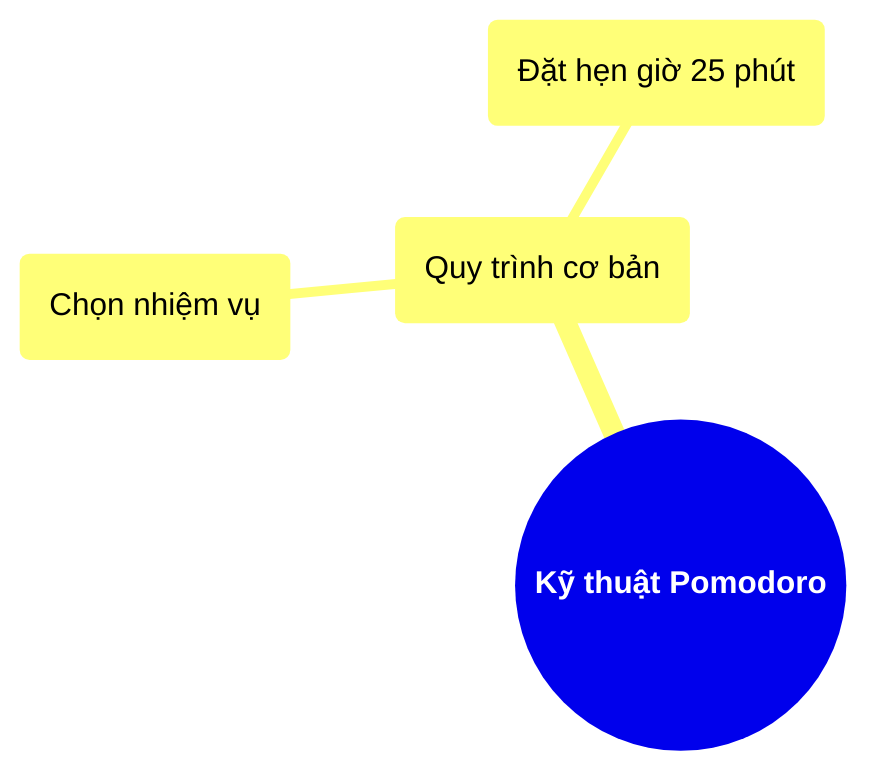

# Mindmap Skeleton

Full file skeleton. Everything in `<angle brackets>` gets replaced.

~~~markdown
# <Topic Title>

## MindMap

<link href="https://cdnjs.cloudflare.com/ajax/libs/font-awesome/6.5.1/css/all.min.css" rel="stylesheet" />

```mermaid
%%{ init: { 'theme': 'base', 'themeVariables': { 'primaryColor': '<hex>', 'primaryTextColor': '<hex>', 'secondaryColor': '<hex>', 'secondaryTextColor': '<hex>', 'tertiaryColor': '<hex>', 'tertiaryTextColor': '<hex>', 'mindmapRootColor': '<hex>', 'mindmapMainColor': '<hex>', 'mindmapSecondaryColor': '<hex>', 'mindmapTertiaryColor': '<hex>', 'mindmapTextColor': '#333333', 'mindmapLineColor': '<hex>' } } }%%
mindmap
  root(("`**<Topic Title>**`"))
  ::icon(fa fa-<root-icon>)
    (<Branch 1 keyword>)
    ::icon(fa fa-<icon>)
      <named leaf concept>
      ::icon(fa fa-<icon>)
      <named leaf concept>
      ::icon(fa fa-<icon>)
    (<Branch 2 keyword>)
    ::icon(fa fa-<icon>)
      <generic descriptive leaf, no icon needed>
      <generic descriptive leaf, no icon needed>
```
~~~

Give leaves an icon when they name a distinct, memorable concept (a specific
technique, tool, pattern, habit). Plain descriptive phrases that just
elaborate on their parent don't need one — icon-ing everything dilutes the
effect.

## When a branch has too many children

If a category has more than ~6 direct items (e.g. 11 behavioral design
patterns), don't list them all flat under one branch — split into named
sub-groups, each a node of its own with its own icon:

```
    (Behavioral Patterns)
    ::icon(fa fa-comments)
      (Message Flow)
      ::icon(fa fa-route)
        Observer
        ::icon(fa fa-eye)
        Mediator
        ::icon(fa fa-diagram-project)
      (Object Behavior)
      ::icon(fa fa-gears)
        State
        ::icon(fa fa-toggle-on)
        Strategy
        ::icon(fa fa-chess)
```

Flat lists of 7+ siblings are what causes real layout problems — nodes and
icons crowd together and visually overlap, not just a cosmetic nitpick.

## Visual size hierarchy: root biggest, shrinking to leaves

Mermaid's mindmap has no font-size-per-depth setting — there's no
themeVariable and no self-contained way to make one level's text literally
larger than another's. The lever that actually exists is **shape**: a
double-paren circle renders as a large filled circle sized to fit its text
(verified by rendering a test file: an ~140px-diameter circle vs a ~170×54
rounded box vs a plain-text leaf with no container at all), so shape choice
by depth *is* the size hierarchy:

- **Root**: double-paren circle, bold text —
  `root(("`**Title**`"))`. Biggest shape, boldest text, unmistakably the
  focal point.
- **Branches**: single-paren rounded box — `(Title)`. Medium-sized,
  automatically smaller than the root circle.
- **Leaves**: plain text, no shape at all. Smallest visual footprint by
  default — this is exactly what you want, so don't add shapes to leaves
  just for the sake of it.

This is why the skeleton above already nests shapes this way — it isn't
arbitrary styling, it's the mechanism that produces "root looks biggest,
leaves look smallest" in an actual render.

## Rules that keep this valid Mermaid

- No `config: layout: tidy-tree` frontmatter. It needs a separate plugin
  package most Mermaid renderers don't ship with, so it hard-fails outside a
  narrow set of environments. Plain `mindmap` with no layout override is
  what's portable.
- `::icon(fa fa-name)` goes on its own line **immediately after** the node
  it decorates, indented to match that node's continuation (see the working
  example in `Notes/Psychology/BigFivePersonalityTraits.md` for the exact
  indentation behavior Mermaid expects).
- Indentation is 2 spaces per nesting level, consistent within a level.
  Mermaid's mindmap parser infers hierarchy from indentation depth — an
  inconsistent indent silently breaks the tree.
- **Never split a node's label across two raw source lines** — not even for
  a long root title. Mermaid's mindmap parser determines the tree structure
  from each line's indentation; a wrapped continuation line reads as a new
  sibling/child and breaks the diagram (this has been observed to produce
  real render failures, not just ugly output). If a label is too long,
  shorten it — don't wrap it.

## Text that breaks unquoted Mermaid parsing (non-ASCII, hyphens)

Two kinds of label text are known to break plain/unquoted mindmap nodes in
real Mermaid renderers:

- **Non-ASCII characters** — Vietnamese diacritics, CJK, or anything outside
  plain `A-Za-z0-9`/ordinary punctuation. Many Mermaid versions still in
  common use (bundled with markdown-preview plugins, older VS Code
  extensions, etc.) only lex bare/unquoted node text as ASCII.
- **Hyphens** (`-`) — observed to break plain unquoted labels too (e.g.
  "Client-specific interfaces", "Square-Rectangle problem"). Prefer
  rewording to drop the hyphen when the meaning survives ("Client specific
  interfaces") — simpler, and the node keeps its natural minimal shape.
  When the hyphen is essential to the term, quote it instead of rewording.

Mermaid's fix for both is the same: wrap the text in backticks inside
double quotes, inside *some* shape — `("`<text>`")`, `["`<text>`"]`, etc. An
explicit node id is optional; an anonymous shape works fine, exactly like
the plain (unquoted) branch nodes elsewhere in this file already do:

```
("`Square-Rectangle problem`")
```

Apply this to **every** node whose label has one of these problem
characters — root, branches, and leaves alike — while leaving any node with
plain safe text in its normal unquoted style. Quoting still works inside
every shape (confirmed by rendering test files with circle, round, and
square shapes all holding quoted text), so **keep the same size hierarchy
from the previous section** rather than flattening every node to the same
shape — that hierarchy is exactly as achievable for a quoted node as an
unquoted one:

- Root: `root(("`**Title**`"))` — circle + bold, keeps the reserved id
  `root`.
- Branches: `("`Title`")` — round shape, anonymous is fine.
- Leaves: plain shape-less text if the text is safe; `("`Title`")` if it
  needs quoting — a round shape here is still smaller than a square-bracket
  box would be, so it stays closer to a plain leaf's minimal footprint.

Icons still go on the following line as usual:



If a topic mixes safe and problem labels (e.g. an English category name
with foreign-language or hyphenated examples underneath), only the problem
nodes need quoting — leave the safe ones in their normal unquoted style so
they keep the truly-shapeless minimal look.

## Optional contrast sub-pattern

When a branch naturally splits into two opposing sides (High/Low,
Pros/Cons, Before/After, Do/Don't), nest it like this — `fa-plus`/`fa-minus`
read universally as "more of this" / "less of this":

```
    (<Branch keyword>)
    ::icon(fa fa-<branch icon>)
      <Side A label>
      ::icon(fa fa-plus)
        <trait/example>
        <trait/example>
      <Side B label>
      ::icon(fa fa-minus)
        <trait/example>
        <trait/example>
```

Only use this when the topic genuinely has two poles — don't force every
branch into High/Low if the topic is more like a sequence of steps or a
flat list of categories.
